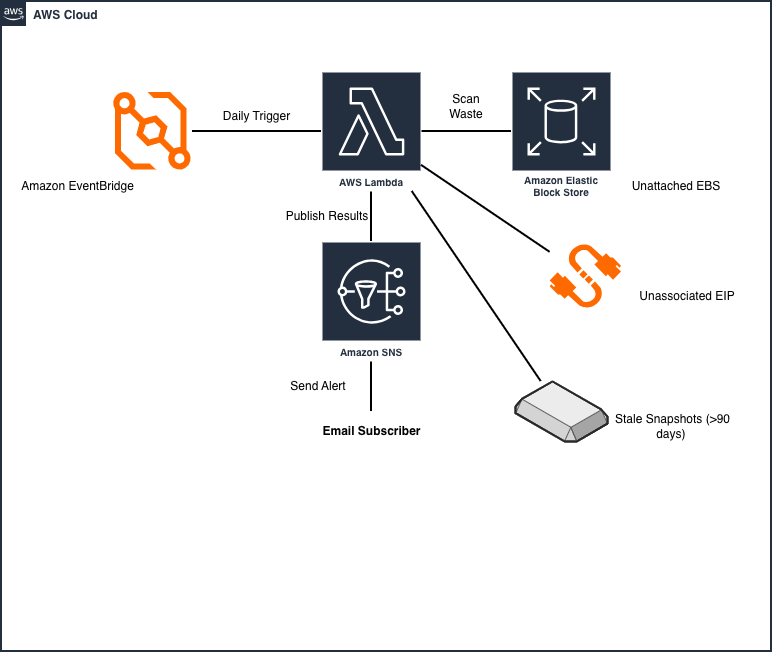

# AWS FinOps Waste Scanner (Automated Infrastructure & Cost Optimization)



## Overview
An automated, event-driven FinOps solution built on AWS using Terraform. This system identifies unused and orphaned cloud resources (unattached EBS volumes, unassociated Elastic IPs, stale EBS snapshots) to eliminate cloud waste and generate daily cost-optimization reports.

## Architecture & Workflow
- **EventBridge**: Triggers daily execution scheduled via cron.
- **AWS Lambda (Python 3.x)**: Scans AWS infrastructure for orphaned resources.
- **Amazon SNS**: Sends instant email notifications summarizing potential monthly savings.
- **State Management**: Remote S3 Backend with DynamoDB state locking for concurrent execution safety.

## Infrastructure Deployment (Terraform)

### Prerequisites
- AWS CLI configured with appropriate IAM permissions.
- Terraform v1.x installed.

### Quick Start
```bash
# Initialize Terraform and configure remote backend
terraform init

# Review execution plan
terraform plan

# Deploy infrastructure
terraform apply -auto-approve
